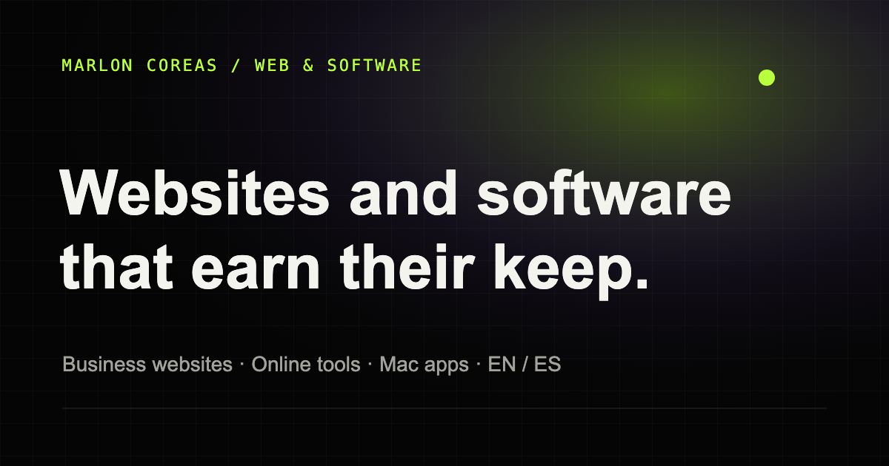

# Independent Developer Portfolio

A bilingual portfolio built with vinext. English is the default language and Spanish lives at `/es`. Dedicated bilingual service pages explain business websites and custom software without relying on unverified outcome claims.

**Live site:** [marloncoreas.com](https://marloncoreas.com)



## Local development

```bash
npm install
npm run dev
```

Create a production build with:

```bash
npm run build
npm run preview
```

## Deploy to Hostinger (static hosting)

```bash
npm run export:hostinger
```

This builds the app, snapshots every public page plus `robots.txt` and `sitemap.xml`, and assembles `dist/hostinger/` plus an upload-ready `dist/hostinger.zip`. Upload the **zip** to `public_html` in hPanel and extract it there — that guarantees the hidden `.htaccess` files arrive too. The export bakes in `https://marloncoreas.com` (override with `NEXT_PUBLIC_SITE_URL`); the `.htaccess` serves clean URLs without redirects, forces HTTPS, redirects `www` to the apex domain, returns a real 404 page, and caches hashed assets for a year.

## Update personal details

The shared email address, social links, project links, and all English/Spanish copy live in [`src/i18n.ts`](src/i18n.ts). Update the `site` object first when a dedicated portfolio email becomes available. The canonical site URL is also centralized there as `siteUrl`.

## Contact form

`public/api/contact.php` handles project inquiries on Hostinger. It validates fields, checks same-origin requests, uses a honeypot and a one-minute IP-hash rate limit, and sends the message to `hello@marloncoreas.com`. Confirm that PHP mail delivery is enabled for the domain after every hosting migration. The direct email link remains available as a fallback.

## Optional analytics

Set `NEXT_PUBLIC_GA_MEASUREMENT_ID` during build to enable privacy-reduced GA4 measurement. When omitted, no third-party analytics script loads. Conversion interactions still dispatch a local `portfolio:conversion` browser event so another analytics provider can be connected later without changing the markup.

When the custom domain is ready:

1. Set `NEXT_PUBLIC_SITE_URL` in the hosting environment (see `.env.example`).
2. Rebuild and redeploy — canonicals, `robots.txt`, and the sitemap are generated from that variable.

## SEO and performance

- Server-rendered HTML for both languages
- Canonical URLs and `hreflang` alternates
- Open Graph and Twitter metadata
- JSON-LD profile data
- XML sitemap and `robots.txt`
- Responsive WebP project imagery
- Reduced-motion support and accessible landmarks

Latest local Lighthouse production audit: 90 Performance, 100 Accessibility, 100 Best Practices, and 100 SEO.
